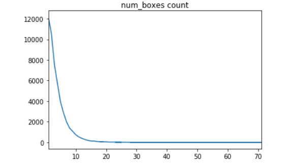
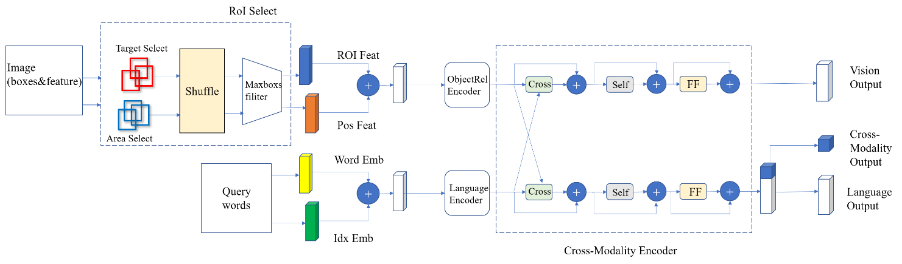
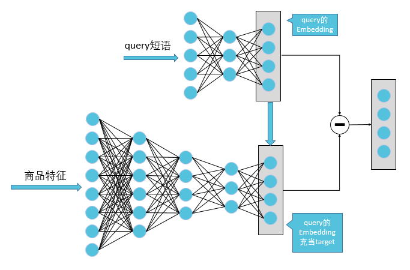
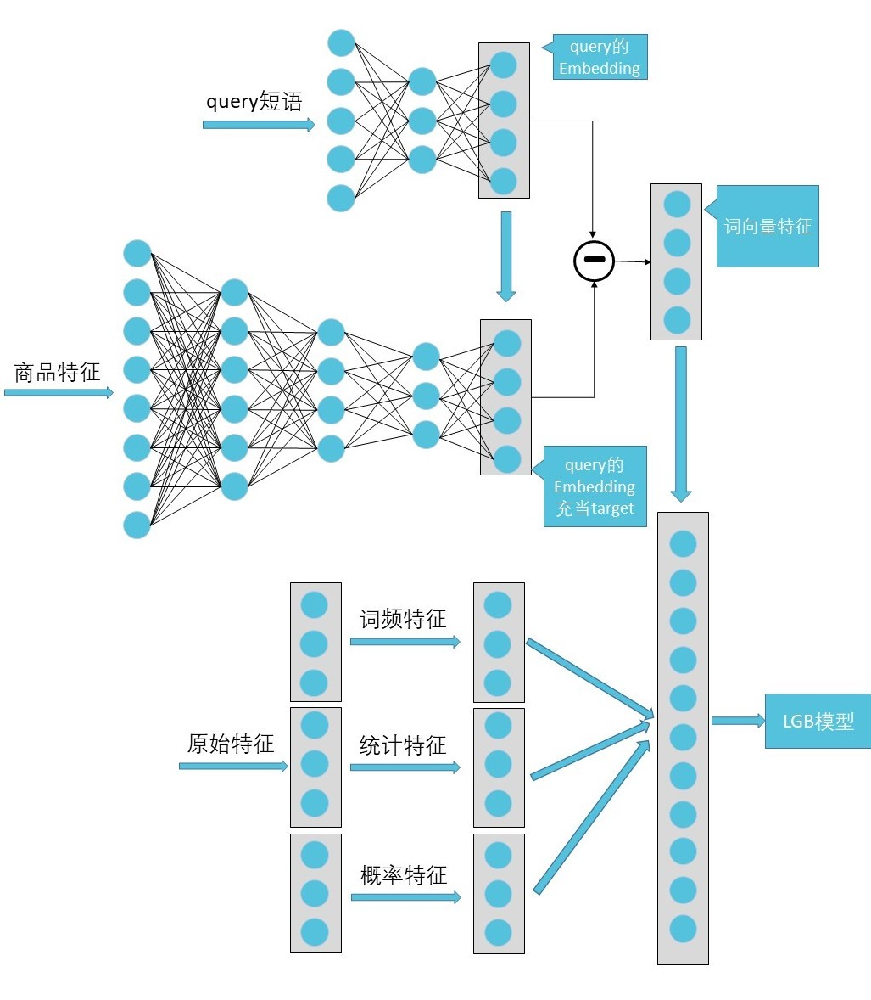
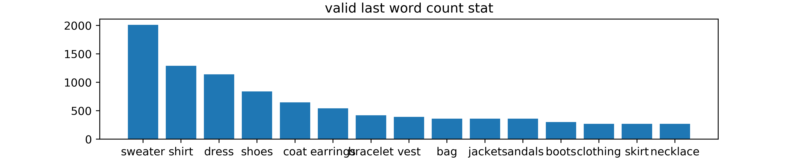
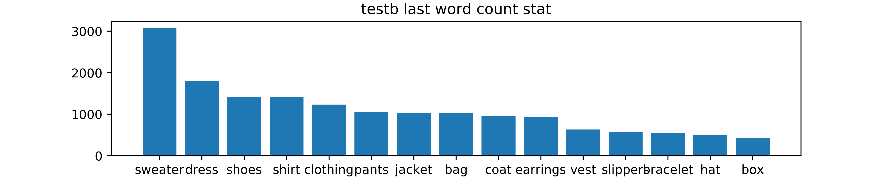
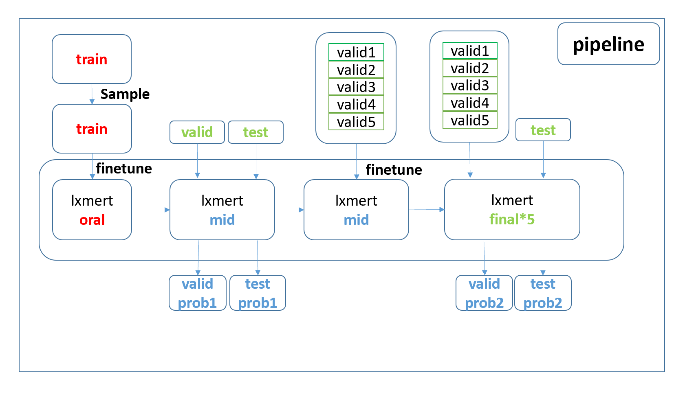
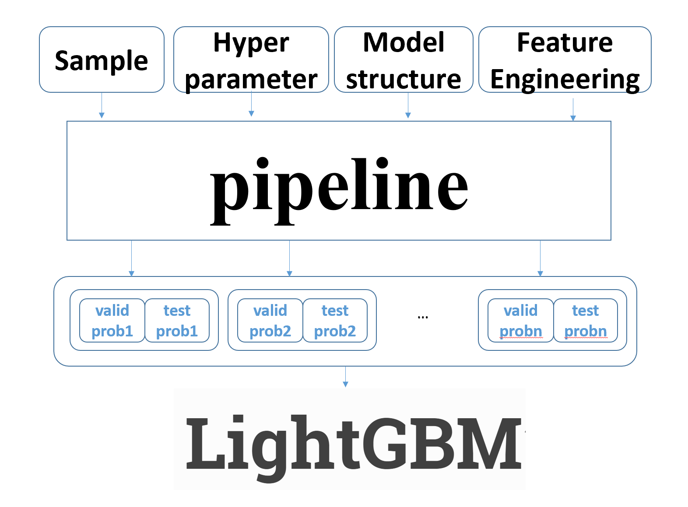

# Introduction

KDD Cup 2020 Multimodalities Recall 这个赛题主要是淘宝真实业务场景下基于用户query的多模态召回问题。参赛选手们需要根据官方提供的query和商品图片特征对候选商品进行排序，最终的评价指标是nDCG@5 ，具体可见[官网](https://tianchi.aliyun.com/competition/entrance/231786/information)。

testA   0.711(排名13)   testB  0.743(**排名8** **↑ 5**)  ， 摸奖成功。

说几个令人震惊的发现：

1. 单单使用image特征的平均值（2048维），交给lgb Rank线上可以得到52+
2. 单类模型的集成收益就不大，贝哥的lxmert模型单模线下最高700，而通过数据预处理、模型结构、训练策略的调整只可以达到702
3. 融合lgb的rank模型收益很大，在2中加入lgb的模型的输出概率作为特征线下即可到达780，线上最终分数为743

# 最终方案说明

我们的最终方案可以概况为以下的三部分，在后文会逐一进行详细介绍。

1. LXMERT模型
2. 基于LightGBM的Learning to Rank模型
3. Ensemble

## Part1. LXMERT模型
### 模型选取
基于LXMERT模型的预训练模型进行fine-tune，它来自 5 个不同的有代表性的预训练任务：（1）掩码交叉模态语言建模；（2）通过ROI特征回归进行掩码目标预测；（3）通过检测到的标签分类进行掩蔽目标预测；（4）交叉模态匹配；（5）图像问题解答。这些任务对模型进行了大量的图像和句子对的预训练，让模型学到了模态间和跨模态的关联。我们的方案就是基于pretrained LXMERT模型在比赛数据集上进行fine-tune。
### ROI Select机制
我们分析了赛题的视觉属性的数据，发现在很多样本中存在大量无关的box以及标注有偏差的box，下图是在采样后的训练集中，可视化每个样本的box数量：

如果不加选择的去进行模型训练的话必然会使模型变得难以很好的收敛且学习到的特征存在偏差。所以本题在LXMERT原有模型的基础上加上了ROI Select机制。

Target Select是对所有的box类别做统计，我们认为一个query语句一定在数据集的30多个类别中存在主要类别，所以针对一个样本我们会在target select中mask非主要类别的box。Area Select是筛选出TOP N个面积最大的box，我们通过观察数据发现，当一个样本的box数量很多的时候（>20），面积过小的box往往是和query甚至是和物体类别无关的，所以Area Select更关注于明显的box以及他的feature信息。
对于初始的图像类型数据分别做Target Select和Area Select后，我们将刷选出的box混合到一起，为了避免引入不必要的空间语义信息，这些box的顺序会被打乱，并通过设置最大的box数（本方案分别测试了box数位5、20），来选出符合条件的box以及box对应的feature。

### Hard Sample机制
由于验证集和测试集中样本大多来自同一类型的数据，即当query是鞋子时，候选池中的图片也大多为鞋子。导致基于随机选择负样本构建的模型在实际验证过程中分数不理想，因此我们基于query相似度选择选取更加符合valid和test的负样本，在训练集上的操作具体流程如下:
1. query中最后一个单词（last_word）往往代表当前query中的名词（符合大家搜索习惯），因此首先根据last_word对query分组
2. last_word分组后计算组内Top-K相似度
3. 选取Top-K的query作为负样本query（在此我们选取组内相似度后20%的作为负样本）
4. 为防止负样本较少造成的过拟合问题，以一定概率选取Hard Sample或随机选取query作为负样本

### 整体流程图

### 训练机制
1. LXMERT预训练模型直接训练
2. 基于ROI Select机制的LXMERT预训练模型（在此我们尝试了box数量为5、20）
3. 基于Hard Sample机制的LXMERT预训练模型

## Part2. 基于LightGBM的Learning to Rank模型

这题的评价指标是nDCG，我们自然而然得想到了Learning to Rank的方法，直接去进行nDCG的优化。LambdaMART是Learning to Rank的其中一个算法，适用于很多的排序场景，Yahoo! Learning to Rank Challenge比赛中夺冠队伍用的就是这个模型，微软Bing也在较长一段时间内使用了这个模型。

我们最终采用了基于LightGBM的LambdaMART方法，通过提取了一系列的特征来对商品进行排序建模，直接进行nDCG的优化。

### 训练数据
官方提供验证集数据中，每个搜索id对应多个target，其中为5个正例其余均为反例，根据LightGBM模型的特点，验证集数据符合模型要求的数据格式。但由于验证集数据数量过少，所以采取在训练数据中人为构造负样本来模拟真实数据。构造策略为随机选取与搜索id不匹配的数据，将搜索id于其进行合并将target置为0.
### 特征构造
1. 词频特征：运用CountVectorizer与TfidfTransformer统计验证集与测试集中query的词频，作为新的特征，此特征可以从从侧面反映出热门商品与热门搜索词之间的关系
2. 统计特征：围绕搜索id，产品id，class构造统计特征，挖掘产品，搜索词，类别之间的深层关系。例如统计每个id对应的class数量以及统计商品照片对应的class数量，挖掘两者之间最大数量的关系。
3. 概率特征：围绕搜索id，产品id，class构造概率特征，例如计算搜索id对应最多类别概率与商品最大概率类别之间的隐含关系等
4. 词向量特征：此赛题的重难点为如何挖掘query与商品之间的隐含关系。主办方提供由CNN网络得到的商品的高级特征，共2048维。query则为单词短语，主办方并未提供其高级抽象。故我们可以人为训练得到query的高级抽象，再将得到的特征与CNN得到商品高级抽象进行联合以进行后续下游任务。针对本次赛题，主要采取的策略为：
  1. 将训练集中大量的query短语抽取出来。
  2. 将从训练集中得到的query短语，送入NLP模型中得到其高级抽象。
  3. 利用NLP模型得到的特征，自定义DNN网络，训练数据为商品的高级抽象，target为NLP得到的query高级抽象。
  4. 训练DNN网络，用商品的特征逼近query短语特征，得到二者关系。
  5. 利用训练好的NLP模型与DNN模型分别对验证集与测试集提取相应的特征，将二者之差作为新的特征。特征提取与构造如下图所示。

### 模型训练
基于bagging的思想，采用5折交叉验证的方式进行模型训练，对得到的5个模型做均值融合。
### 整体流程框图
1.	使用训练集中query短语训练NLP模型
2.	自定义DNN网络使CNN得到的商品高级抽象逼近NLP模型的输出
3.	使用训练好的NLP模型与DNN模型作用在验证集和测实际上，将二者差值作为新的特征
4.	使用原始特征构造词频特征，统计特征，概率特征等，并且与上一步得到的特征进行融合
5.	送入LGB模型中进行训练

## Part3. Ensemble
### 验证集与测试集的相似性、训练集与测试集的差异性

整个训练集包括3M对相互匹配的query与产品图片的特征，而验证集与测试集则提供了若干query信息，每个query对应一个30左右大小的商品候选池，从结构上训练集与后两者的差异显而易见，另一个差异在于，很多在train中大量出现的商品类别，在测试集与验证集并未出现，如books。
而测试集与验证集在商品类别上具有很强的相似性。不难发现，query最后一个单词往往就是商品的具体类别，按照最后一个单词进行统计，可以得到训练集与测试集的高频词，如下图所示。

为了充分利用验证集与测试集的相似性与规模庞大的训练集，本文使用了**迁移学习**与**嫁接**两种技术。
**迁移学习**在计算机视觉的各个领域被广泛使用，源域与目标域的相似性是这一技术成功应用的关键。本文使用的lxmert模型在训练集上微调之后，采用五折stacking方法继续在验证集中微调，事实证明，会取得明显的提升。
植物（竞赛ID）在IJCAI2018竞赛中，初次提出**嫁接**这一说法，当可用于训练的数据中包含与测试集分布不一致的数据集，可以考虑不丢弃这一部分（特别是这部分数据量较大时），而是使用这部分数据先训练一个模型（使用剩余部分做验证，从而使用早停等训练策略），然后对剩余部分（与测试集分布较为一致的部分）以及测试集进行预测，并把输出向量作为特征，在剩余部分继续训练一个模型。这样既可以保证充分利用所有数据，又不影响模型的泛化性能。

### 集成方案
在嫁接与迁移学习两种思路的引导下，模型的训练过程可以抽象成如下Pipeline，具体过程如下描述：

|      Pipeline 步骤：       |
| :------------------------: |
|  1.对原始特征进行特征工程  |
|   2.对训练集进行采样操作   |
|     3.在训练集进行微调     |
|  4.第一次嫁接生成特征表示  |
| 5.在验证机上进行五折的微调 |
| 6.第二次嫁接生成特征表示2  |

在Pipeline的基础，通过改变**特征工程的方法**，**采样方式**，**模型结构**，**训练超参**，生成若干组特征表示，最后使用LightGBM完成最后集成。
有两点需要说明的是，Pipeline的模型，也可以是LightGBM，只需将第一次微调操作改成训练，将第二次微调操作改成继续训练即可。省略在训练集训练这一步，亦可生成有效的特征表示。实际上，在只用图像特征的情况，在验证集上使用LightGBM进行训练，即可达到50+的线上分数（**令人震惊**且值得考虑的问题），加入query等特征后，在验证中oof(out of fold)的表现可达0.62+。

# 最终结果
最终我们融合了20个模型，最高分为**0.7426**,在testa上单模最高65+，在testb优化没有进行测试（线下由68->70），但应该有明显提升（估计在**68**左右）。
其中包括13个LXMERT模型，4个hard_sample_LXMERT模型，3个基于特征的LightGBM模型

# 其他尝试

我们也实验了visul-bert、vlbert、 uniter等多模态bert模型，但由于算力限制、调试困难等等原因，最终没集成到我们的最终方案中。有待以后进行更多的尝试。

# 联系方式

如有问题请联系：hi@zhangqibot.com

# Reference	

[赛题官网](https://tianchi.aliyun.com/competition/entrance/231786/information)

[LightGBM](https://github.com/microsoft/LightGBM)

[Learning to Rank Using Gradient Decent](https://icml.cc/2015/wp-content/uploads/2015/06/icml_ranking.pdf)

[LXMERT: Learning Cross-Modality Encoder Representations from Transformers](https://arxiv.org/pdf/1908.07490.pdf)

[结构化数据的迁移学习：嫁接学习](https://zhuanlan.zhihu.com/p/51901122)

[嫁接](https://github.com/plantsgo/ijcai-2018)

